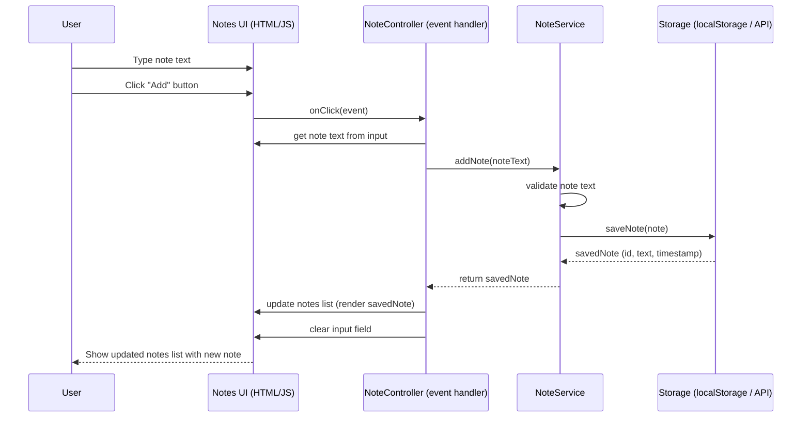

```mermaid
sequenceDiagram
    participant U as User
    participant UI as Notes UI (HTML/JS)
    participant C as NoteController (event handler)
    participant S as NoteService
    participant ST as Storage (localStorage / API)

    U->>UI: Type note text
    U->>UI: Click "Add" button

    UI->>C: onClick(event)

    C->>UI: get note text from input
    C->>S: addNote(noteText)

    S->>S: validate note text
    S->>ST: saveNote(note)
    ST-->>S: savedNote (id, text, timestamp)

    S-->>C: return savedNote
    C->>UI: update notes list (render savedNote)
    C->>UI: clear input field

    UI-->>U: Show updated notes list with new note

```
